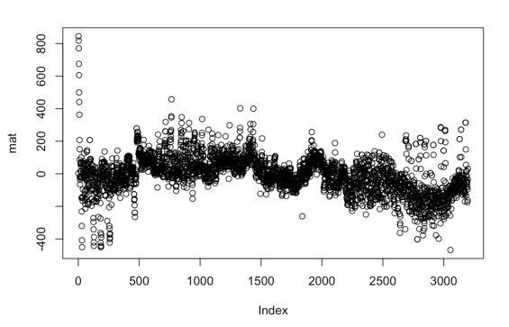

# Classification of exo planets. 

One Paragraph of project description goes here

## Getting Started

These instructions will get you a copy of the project up and running on your local machine for development and testing purposes. See deployment for notes on how to deploy the project on a live system.



### Prerequisites

What things you need to install the software and how to install them

```
Give examples
```

### Installing

A step by step series of examples that tell you have to get a development env running

Say what the step will be

```
Give the example
```

And repeat

```
until finished
```

End with an example of getting some data out of the system or using it for a little demo

## Results 

We will insert a written description of our results along with a few key graphs. 


## Built With

* [R](https://www.r-project.org/) - Used as a platform for our statistical analysis and machine learning algorithms. 

## Authors

* Rafael Orozco, Leonard Orozco. 

## Acknowledgments

* We will acknowledge those masters who helped us once they appear. 
